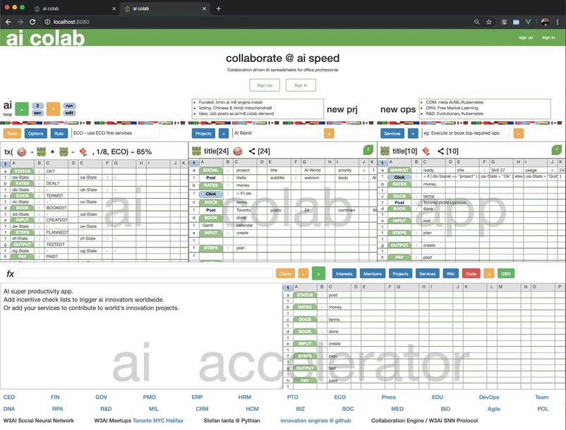

# realtime work from home self help network

collaboration engine / social & enterprise innovation protocol - PoC



## innovation engine install

- download and install node & npm @ https://nodejs.org/
- clone ai player app @ https://github.com/aibase/aigitops/
- open a free basic GCP | Azure | AWS cloud account
- create a realtime db or spreadsheet for users (eg: Firebase or Google Sheets)
- create a realtime db or spreadsheet for data (eg: Firestore or Google Sheets)
- (coming soon: run your own local or cloud ai collab engine)

```
npm install
```

### Compiles and hot-reloads for development

```
npm run serve
```

### Compiles and minifies for production

```
npm run build
```

### Run your tests

```
npm run test
```

### Customize ai engine

Edit src/ai-config.json
